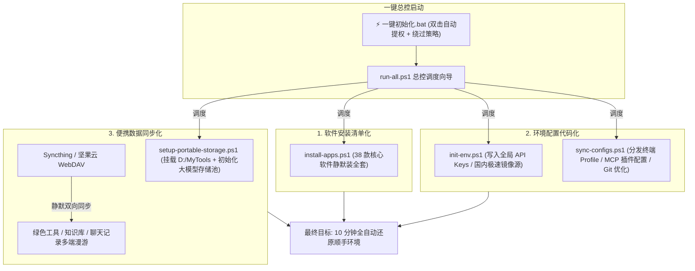

# 开发者跨设备与重装系统：零成本环境同步指南

> **核心哲学**：将重复繁琐的环境搭建转变为 **“软件安装清单化 + 环境配置代码化 + 便携数据同步化”**。  
> 换新电脑或重装系统时，通过代码与自动化脚本在 10~15 分钟内快速恢复 95% 以上的顺手开发环境。

---

## 整体架构全景图

---

## 核心文件与脚本清单

| 文件 | 角色与功能 |
| :--- | :--- |
| ⚡ **[一键初始化.bat](file:///D:/MyTools/跨设备环境同步/一键初始化.bat)** | **总入口**：双击直接运行，自动请求管理员权限并绕过 PowerShell 策略限制。 |
| 📜 **[run-all.ps1](file:///D:/MyTools/跨设备环境同步/run-all.ps1)** | **总控编排脚本**：支持一键跑完全套，或按需单选执行某个模块。 |
| 📜 **[install-apps.ps1](file:///D:/MyTools/跨设备环境同步/install-apps.ps1)** | **软件清单化**：静默安装系统运行库、开发环境、AI 智能体、办公通讯、网盘与小工具共 38 款。 |
| 📜 **[init-env.ps1](file:///D:/MyTools/跨设备环境同步/init-env.ps1)** | **环境变量注入**：一键注入 `OPENAI_API_KEY`、`DEEPSEEK_API_KEY` 与 Node/Go/Python 极速镜像源。 |
| 📜 **[setup-portable-storage.ps1](file:///D:/MyTools/跨设备环境同步/setup-portable-storage.ps1)** | **便携存储挂载**：挂载 `D:\MyTools` 到系统 PATH，初始化 `D:\AI_Models` 模型池（免下数十GB）。 |
| 📜 **[sync-configs.ps1](file:///D:/MyTools/跨设备环境同步/sync-configs.ps1)** | **配置一键分发**：将 `configs/` 内的终端增强 Profile、Git 基础优化与 MCP 插件分发到系统。 |
| 📁 **[configs/](file:///D:/MyTools/跨设备环境同步/configs)** | **中央配置母版库**：内含 `Microsoft.PowerShell_profile.ps1` 与 `claude_desktop_config.json`。 |
| 🛡️ **[.gitignore](file:///D:/MyTools/跨设备环境同步/.gitignore)** | **安全防护**：防止将带有真实私密 API Key 的文件推送到公开代码仓库。 |

---

## 新电脑 / 重装系统终极 SOP（只需 1 步）

在新电脑上拿到 `D:\MyTools\跨设备环境同步` 文件夹后：

👉 **双击运行 `一键初始化.bat`，直接敲回车（选择 1 全部执行）。**

喝杯咖啡的功夫，系统将全自动完成：
1. 创建 `D:\MyTools` 并挂载至全局 PATH。
2. 注入全局 API Key 与国内极速下载镜像源。
3. 部署终端增强快捷指令（`g` 别名、`set-proxy` 代理开关）与 Claude/MCP 插件。
4. 后台静默安装全部 38 款软件。
5. （最后打开 VS Code 登录 GitHub 账号，自动拉回扩展插件与快捷键）。
